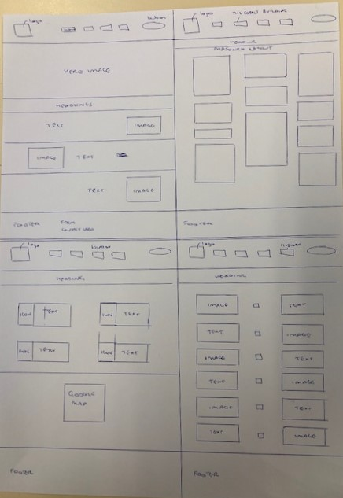

# The Cobalt Building
[View live project here on GitHub](https://priyadevnow.github.io/The-Cobalt-Building-London/)

The Cobalt Building is a luxury residential block of apartments which was built in 1995.  It is located in an area of historic significance within the City of London whose development can be credibly traced since 1 AD.  This website was designed to showcase the Cobalt Building and the area’s heritage over the centuries.  

   
  

---

## CONTENTS  
  
* [UXD (User Experience Design)](#user-experience-ux)
  * [User Stories](#user-stories) 
* [Creation process (Strategy -> Surface)](#creation-process)
  * [Wireframes](#wireframes)
* [Design](#design)
  * [Colour Scheme](#color-scheme)
  * [Typography](#typography)
  * [Imagery](#imagery)
* [Page Features](#page-features)
  * [Navbar](#navbar)
  * [Hero-Image](#hero-image)
  * [Headlines](#headline)
  * [Footer](#footer)
  * [Cobalt Building Page](#Cobalt-Building-page)
  * [Location Page](#Location-page)
  * [History Page](#History-page)
* [Tablet & Mobile View](#tablet--mobile-view)
  * [Desktop, Tablet & Mobile Differences](#desktop-tablet--mobile-differences)
  * [Tablet View](#tablet-view-ipad-miniipad-prosurface-pro)
  * [Mobile View](#mobile-view-iphone-5iphone-seiphone-xriphone-12-pro)
* [Future Features](#future-features)
* [Technologies Used](#technologies-used)
  * [Languages Used](#languages-used)
  * [Frameworks, Libraries, Technologies & Programs Used](#frameworks-libraries-technologies--programs-used)
* [Deployment](#deployment)
  * [How to deploy](#how-to-deploy)
* [Testing](#testing)
  * [HTML Validation using W3C Validation](#html-validation-using-w3c-validation)
  * [CSS Validation using W3C Validation](#css-validation-using-w3c-validation)
  * [Lighthouse scores via Chrome Developer Tools](#lighthouse-scores-via-chrome-developer-tools)
  * [Bugs & Fixes](#bugs--fixes)
  * [Unsolved Bugs](#unsolved-bugs)
* [Credits](#credits) 

---    

## User Experience (UX)  
  
### **User Stories**  

### **Primary Goal**  
  
The Cobalt Building is a luxury residential block with 59 apartments in Bridgewater Square, London.   The aim of this website is to showcase the building and the history of the area.  It needed a strong, succinct and striking website design that reflected the building’s attributes and the area’s importance in the development of the City of London. 

### **Visitor Goals** 

- The website is intended to be accessed by two diverse sets of visitors:

1.  Building residents:-
  *	Apartment owners – to access the Leaseholder Portal containing the building policies and service charge accounts of the individual apartment owner
  *	Tenants – over 80% of the apartments are tenanted by City professionals and students with an average tenant turn-around of two years.  So it was important to clearly set out the attractiveness of the Cobalt Building in terms of location and amenities and the history of the area. 
   
2. History lovers - Bridgewater Square is often overshadowed by its neighbour, the iconic Barbican Estate.  This website attempts to redress that and invites users to visit Bridgewater Square.   

- Keeping the above, the website is straight to the point and easy to navigate for those seeking information about the building, its location and the history of the area. 

- The website has been designed to be responsive to allow visitors to view it from a range of devices with one page flowing seamlessly into another so as to keep the users engaged on each page.   

### **First Time Visitor**
  - A user can access each page of the site with one click via the navigation bar or by scrolling down the respective sections on the landing page.
  - A user can see the address of the building in the footer.

### **Returning Visitor**  
- The returning visitor is one who is seriously interested in the building e.g. as a potential tenant or history lover.  
- Such a user is likely to use a device larger than a mobile.  They will be able to find more relevant information in the footer e.g. social media links, contact form for the Resident Management Company and the contact card for the Property Manager; an apartment owner will  see the Leaseholder Portal button on the navigation bar; a history student can find links for the sources of information collated on this website for further study.
  
--- 

## Design Process  
  
### **1. Strategy**  

- The strtaegy was to build an aesthetically pleasing, evocative, easy-to-read and dependable website that delivers clear information about the Cobalt Building and Bridgewater Square, emphasizing the attributes of the Cobalt Building and the development of the area from a natural to a built environment. Each page must be meaningfully portrayed with concise writing and images of historical maps, photos and modern icons.
- The solidity of the current building and authenticity of the area’s rich history are carried through the entire website with the use of consistent and neat design, graphics, precise wording and colour.  There is no discrepancy between the website representation and when the user physically visits the Cobalt Building. 
- Mobile responsiveness is an essential feature required for this website.
  
### **2. Scope**  

- The Cobalt Building website must be available on a wide range of devices due to the two main diverse sets of users being targetted. 
- The site is to contain only essential information presented artistically using the best utility function for each page.  
- As the information presented on each page will be different, the clever use of the chosen colour palette and styling is essential to make the site cohesive and attractive.
- Text must be clear and legible on any sized device to allow the user access to all the information.  
- Future development is to include all elements in the navigation bar and footer to be visible on all devices and the form link to the Resident Management Company to be activated.
  
### **3. Structure**  

- Similar to the design and layout to be accessible and functional, simple navigation and interactivity are essential. The website needs to provide information swiftly to all users.  
- The colour palette was displayed as the background for the hero image on the landing page so the user became instantly familiar with it and so as to encourage users to stay on the website and go through it page by page.   
- This is an information rich website. Thus, rounded corners have been used for styling sections so that the site is not only aesthetically attractive but it is easier to digest the information presented.  
- The main information on all the pages remains the same on all devices which strengthen the site’s familiar and trusting feeling.  
- In addition, the navigation bar and footer would be visible on every page and at every device size. However, the information displayed has been tailored for the main expected type of user of the device:
- apartment owners are likely to use the desktop version so the navigation bar displays the Leaseholder Portal button which they can use to click into the Property Manager’s resident portal to access the Building policies and their service charge records;
- potential new tenants and history lovers would use the mobile version so the footer displays only the address of the building.    
- Easy to identify, clickable buttons and links with a consistent layout have been used in the navigation bar and footer. 
- Any buttons or links had to clearly state their purpose and any design change upon action followed the flow of the overall aesthetic.  It would have been ideal to provide feedback once the form button was clicked but this was not possible since Javascript is beyond the scope of the technologies allowed for this project. 
  
### **4. Skeleton**  

- The site was developed to be simple, clear and educational.  
- For the landing page, the logo, was to be top-left of every page, no matter the orientation or screen size.  
- The simple, four-item navigation bar of 'Home', 'The Cobalt Building', ‘Location’ and 'History', is situated always in the centre of the navigation bar.  A mouse hover feature is on each item which turns the text from blue to white. When item is clicked the text turns and stays light grey thus identifying the active page.
- A large, clear hero image of the Cobalt Building dominates the landing page with its name at the top left in translucent style visible.   
- Scrolling down the page introduces the visitor to a brief, three-piece of information section about the other pages of the website. Images are visible on one side with sound-byte headed text on the other side.  The images are arranged in a diametric fashion.  
- The page ends with the footer, stating information in four columns, the address of the building, the contact information for the Resident Management Company and the Property Manager for the building, social media links and acknowledgment of the credible sources used to compile the history section of the site.  Under this is a copyright label and the year of site build at the bottom left corner.
- For The Cobalt Building page, the navigation bar and footer remain as before. Between these lies a heading of the page and below it - in masonry format - are the photos of an apartment’s interiors and building exterior as welll as text describing the various attributes of the building.  Information from the marketing brochure for the building and a quote from the Lord Mayor in relation to the building are highlighted.    
- For the Location page, the navigation and footer remain as before. The page heading is under the navigation bar with brief description of the next section which shows places around the Cobalt Building grouped into 4 categories.  These are arranged 2 categories in each of 2 rwos.  Each category is shown with anicon and text. Underneath this is an interactive Google Map with the building location pinned. There is an option to enlarge the map in a new window and find directions.  
- For the History page, the navigation and footer remain as before. The page heading is under the navigation bar with brief description. A stylised vertical timeline has been used which shows an image on one side and an image on the other.  A central dot separates the two sides.  This is followed in diametric fashion for 6 significant periods when major changes occurred in this area from 1 AD to date.   

### Wireframes  

Wireframe for the 4 pages of the webite - Desktop view
  

            

### **5. Surface**  

- A design was created that allowed a consistent flow throughout the four-page website.   
- A palette of blues and yellows was created which matched the exterior facade of the Cobalt Building - yellow rendering and bricks and cobalt blue balconies.  All the colours were used on each page.      
- A clean, sans-serif font, 'Montserrat' was used in a medium weight to provide legible text at any size. 
- Corners on all elements were rounded to maintain a soft feel to a hard brick subject matter. 
- Overall, the design was intended to create and foster a feeling of new discovery with the unveiling of its rich past and a deep sense of belonging to the present and in particular to the Cobalt Building.  This would attract users to physically come and see the building.    
 
---   
  
  
## Design  

### **Color Scheme**  

- I used Coolors to create a striking palette from the complementary colours of blue and yellow which capture the sense of pride and significant meaning that the site is conveying.  I combined these with an off-white shade that contrasted beautifully.
  
.png)  
  
- I experienced an issue with the contrast ratio when putting lengthy blue (#03045E) text against the yellow (#FFBF69) background on the History page.  So I switched the yellow to the off-white (#e5edf5) which then significantly improved the accessibility of my site. The contrast ratio as measured on [TPGI website](https://www.tpgi.com/color-contrast-checker/) showed the WCAG contrast ratio increasing from 10.9.1 to 15.1 from this change.

  
  
- [Adobe Color](https://color.adobe.com/create/color-contrast-analyzer) provided this fantastic resource for checking how accessible your colours are. I submitted my palette to the [Color Blind Safe](https://color.adobe.com/create/color-accessibility) check to find they passed this test also.  

  
### **Typography**  
  
- [Google Fonts](https://fonts.google.com/) was used to import the fonts 'Montserrat'.  The Montserrat font has a geometric sans-serif typeface and it was inspired by posters, signs and painted windows from the first half of the twentieth century, seen in the historic Montserrat neighbourhood in Buenos Aires.  I therefore felt it was appropriate to convey the architectural and history aspects of the website.  
- I used the [Figma font pairing selector](https://www.figma.com/google-fonts/) to help me choose the Klara font to pair with Montserrat for use in lengthier text bodies. However, I chose to stick with Montserrat.  This would keep the font consistent across the website given the aim was not to make the website over-wordy. 
  

        
### **Imagery**  
  
- I have used different types of imagery so as to remain authentic about the website.  I have used:
  *	Historic photos from books and archives
  * Historic maps - some of which have been made dynamic with modern technology which helped me get a snapshot of the precise area covered in the website
  * Modern photos from the marketing brochure for the Cobalt building which was published in 1995
  * Publicly available photos of apartment interiors from estate agent websites marketing apartments available for sale and rent at the Cobalt Building
  *	Royalty free stock images
  * Bootstrap icons
I have attributed the sources of the images used in the [Credits](#credits) section of this README doc.

---  
  
## Page Features  

### **Navbar**   

  

 

This remains the same across the four pages, in portrait/landscape and mobile/tablet views, except that the Leaseholder Portal button appears on desktop view only.
  
   

### **Hero Image**  

  

  

The striking hero image remains the same across all devices, with it becoming square-shaped and ‘The Cobalt’ label disappearing for smaller screens.  

  

 

### **Pages**  

 

  

  

  

Small sound-bytes of text with clear headings are accompanied by striking images that reflect the heading. In tablet/mobile view, these sections are displayed in a column.  

 
  
### **The Cobalt Building Page** 

 

  

The masonry layout occupies the whole page, against the yellow (#FFBF69) background (which is the exterior colour of the Cobalt Building).  Images and stylised text draw out the main attributes of the building and apartments.   The masonry layout automatically rearranges the cards to optimise the viewing experience from different size device screens.  It switches from a 3 column large screen view to a single column for mobile view.

 

### **Location Page**  

 
 
  

There are two sections. The first part I a row which shows an icon and text describing each of 4 areas of interest in the neighbourhood in a 2 top – 2 bottom rectangular grid format.  The icon is positioned to the left of the text for desktop/tablet views and switches to centere in single columnar format for mobile view.   

The second section shows an embedded interactive Google Map sitting in a row.  The smallest width of this page is limited by the size of the Google Map.  

 

### **Footer**  

 

The footer always shows the address of the Cobalt Building and in tablet/desktop devices it shows the Contact form/card, social media icons and Acknowledgements.  

---   

## Tablet & Mobile View  
 
### **Desktop, Tablet & Mobile Differences**  
  
As most of the website code was imported from Bootstrap there was already good in-built responsivity across various screens. I had to make minimal adjustments to improve this.  However, I had to compromise by making some of the elements in the navigation bar, footer and hero image disappear for mobile views as I was not successful in styling these for responsivity.    
### **Tablet View (iPad Mini/iPad Pro/Surface Pro)**  
  

### **Mobile View (iPhone 5/iPhone SE/iPhone XR/iPhone 12 Pro)**  
  

---  
                              

## Future Features  

- For future development, I would like to be able to:
- show all of the footer and the button to the Leaseholder Portal in the navigation bar on all screen sizes    
- put an embedded video showing a tour around the present Bridgewater Square
- show testimonials from site visitors
  
---   
  

## Technologies Used    

### **Languages Used**   

- HTML5
- CSS3

### **Frameworks, Libraries, Technologies & Programs Used**  

- Bootstrap version 5.2.3 – examples and icons – assisted with styling and responsiveness of website
- Stockoverflow – to look up code
- W3 Schools – to look up code
- Gitpod - used for version control by utilising the Gitpod terminal to commit and push to GitHub
- GitHub - used to save and store all files for this website after being pushed from Gitpod- Figma – I tried to use it to create wireframes but found it difficult so resorted to pen and paper 
- Coolors – for colour palettes- Adobe Color – for accessibility contrast ratios
- Canva – for designing the logo
- Google Fonts – font was imported from here 
- Google Dev Tools - to debug and for testing responsiveness 
- Google Lighthouse - for auditing the website
- W3C Validator - for validating the HTML and CSS code 

---   
 

## Deployment

### **How to deploy**  

GitHub was used to deploy the website. These were the steps taken to achieve this:  

1. Login to GitHub account
2. Navigate to the project repository, scoops_pp1
3. Click the Settings button near the top of the page
4. In the left-hand menu, find and click on the Pages button
5. In the Source section, choose 'main' from the drop-down, select branch menu
6. Select 'root' from the drop-down folder menu
7. Click 'Save' and after a few moments the project will have been made live and a link is visible at the top of the page

 

---  
    

## Testing  

I had planned for this site to be accessible and legible on all screen sizes. I extensively used Chrome Dev Tools to test, tweak and debug throughout the build phase. 

  
  
The results of feature testing are as follows: HOW TO CREATE TABLE  
  
| Page | Test | Pass/Fail |
| :----| :----| :--------:|
| All  | Cobalt Building logo links back to homepage | Pass |
| All  | Text colour changes to white  in navigation items when the mouse hovers | Pass |
| All  | Active navigation bar items are off-white text | Pass |
| All  | Navigation links bring the user to relevant page | Pass |
| Index  | Footer social media icons bring the user to relevant sites via a new tab | Pass |
| Index  | 'Contact' heading has a form and contact card which are responsive and functional | Pass |
| All  | Images and sections are responsive in different media sizes | Pass |

| History | History items are clear and legible | Pass |
| Contact | Google Map is interactive and opens in a new tab for a larger map | Pass |

 
### **HTML Validation using W3C Validation**  

Index/landing page HTML validation
  

   

Menu page HTML validation
  

  

Contact page HTML validation
  

  
  
   

### **CSS Validation using W3C Validation** 

SCOOPS CSS validation
  

   

   

### **Lighthouse scores via Chrome Developer Tools**   
  
For Desktop   

Lighthouse audit for Index page
  

 

Lighthouse audit for Menu page
  

Lighthouse audit for Contact page
  

      

 
  
For Mobile   

Lighthouse audit for Index page - Mobile
  

 

Lighthouse audit for Menu page - Mobile
  

Lighthouse audit for Contact page - Mobile
  

      
  
  
### **Bugs & Fixes**  
  
| Bug | Section | Fix |
| :----| :----| :--------:|
| Nesting button element & anchor element | Index/Home page | When running an early W3C validation test, I discovered that I had made an error by placing a button element inside an anchor element within my tagline section. Semantically, this was incorrect. I considered using a span element instead and upon consulting Stackoverflow and this [post](https://stackoverflow.com/questions/6393827/can-i-nest-a-button-element-inside-an-a-using-html5) I confirmed my understanding. I re-checked my HTML code with W3C Validator and my live site to find the issue resolved. |
| br element in li element  | Menu Page |  Semantically I made an error by using the br element to make space between my menu items. On performing the W3C validation test, I became aware of this error. I considered using margin-top to fix the issue. I Googled the issue to understand my error further and came across a Stackoverflow [post](https://stackoverflow.com/questions/66564503/wrong-validation-on-element-br-in-ul-li-elements), with a comment from Quentin detailing how to use margin-top avoiding the first child element of the parent div. I used this piece of code in my CSS file to control the spacing between the menu items after understanding the code fully. |

### **Unsolved Bugs** 

- Some of the Location page masonry images lie on top of the footer when this page is opened first.  I have not managed to understand why this happens so I will keep researching to solve this issue.
- The Leaseholder Portal button in the navigation bar is not responsive so I had to remove it for smaller screen views but I will try to find the reason for this and find a solution.
- The footer responsiveness also needs to be improved so that all the 4 columns fit for all screen views.  I will continue to look for a solution for this.  

---  

## Credits  
  
### **Content References**
- All the content written for the website is by myself, based on extensive research which I did.
- [Code Institute](https://codeinstitute.net/ie/) for their HTML/CSS learning material.
- [W3Schools](https://www.w3schools.com/) for additional learning material.
- [Bootstrap example for masonry] (https://getbootstrap.com/docs/5.0/examples/masonry/)
- [Codepen] (https://codepen.io/Maxalos/pen/MXXqGj) for the stylish vertical responsive timeline
- Fred Rodgers – a neighbour and long-term Barbican resident who provided his paper on the history of the Barbican Wildlife Garden and pointed out further resources to me
- Jonathan Spengler who pointed me to Caroline Sandes paper on the THE BARBICAN BEFORE BARBICAN: THE HOUSE, ITS HISTORY AND THE ‘IMAGINARY’ WATCHTOWER
  

### **Media References**  
  
- [London Metropolitan Archives](https://www.cityoflondon.gov.uk/things-to-do/history-and-heritage/london-metropolitan-archives)
- [British Museum](https://www.britishmuseum.org/)
- [British History Online]( https://www.british-history.ac.uk/)
- [the interactive Ogilby & Morgan Large Scale Map of London as Rebuilt in 1676](https://www.british-history.ac.uk/no-series/london-map-ogilby-morgan/1676) 
- [The interactive MOEM AGAS Map](https://mapoflondon.uvic.ca/map.htm)
- [Old & New London by Thornbury & Edmond book](https://www.british-history.ac.uk/old-new-london/vol1/pp1-16)
- The 1995 Marketing Brochure for the Cobalt Building
- [Dexters estate agents photos of apartments for rent in Bridgewater Square]
- [Dreamtime] (https://www.dreamstime.com/stock-photo-city-london-panorama-image46882167)
- [Google Maps](https://www.google.com/maps) for the map used in this website

### **Acknowledgements** 
- I would like to express my deep gratitude to  my course instructor Richey Malhotra for his patience and guidance and most of all for setting me up with the hero image for the landing page of this website
- I am grateful for the support and help given by my cohort colleagues Rob, Rosie and Sharon for debugging and design   
- I am thankful to WAES and the Code Institute for providing this unique opportunity for me to upskill and learn Digital Skills
- I am grateful to my sister for looking after our parents so I am able to devote time to create this website

